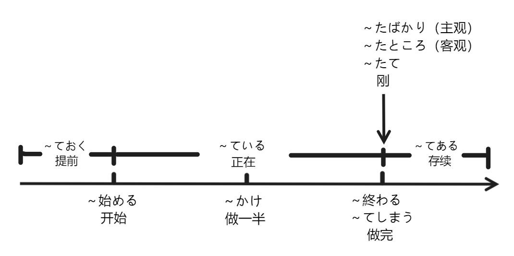

以做饭为例，ご飯を作る。

* お肉とか野菜とか買っておく。
* ご飯を作り始める。
* ご飯を作っている。
  * 作りかけの料理。
* ご飯を作り終わった。
* ご飯を食べてしまった。
* この料理は作りたてで、おいしい。
* ご飯を作ってある。

## 注意

对于たばかり、たところ、たて的区别，参考[たて・たばかり・たところ](./tate.md)。

## 参考

* [一个视频记住完整动作的日语语法](https://www.bilibili.com/video/BV1Lb4y1g7yB/)
