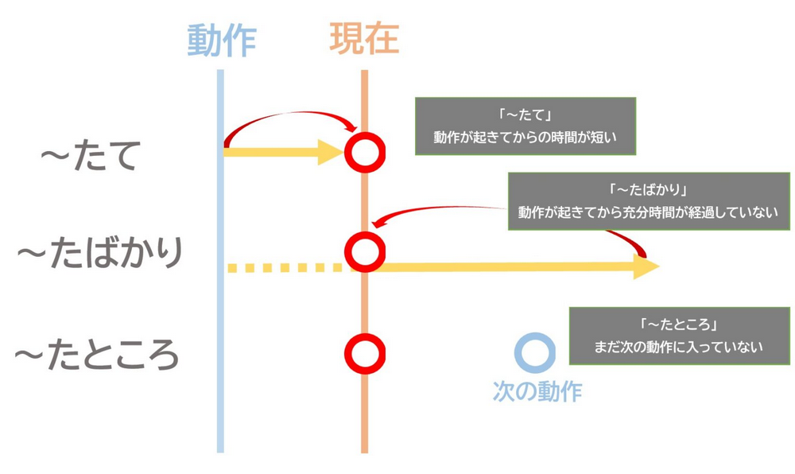

三者的强调之处不同。而在一些参考资料中还会将たばかり和たところ分为主观、客观。

---
{: data-content=" たて "}

> 炊きたてのごはんはおいしいね。

强调距离做饭完成的很短。

---
{: data-content=" たばかり "}

> 入社したばかりなので仕事の段取りがよく分かりません。

强调入职不久。

---
{: data-content=" たところ "}

> 今、電車に乗ったところですから、2時前には着きます。

对下一个动作的说明。有时不一定有下一个动作，自行体会。

## 注意

たところ后不接名词。

## 参考

* [たて、たばかり、たところの微妙な違いについて](https://nantong-japanese.com/2021/08/27/%E3%80%8C%EF%BD%9E%E3%81%9F%E3%81%A6%E3%80%8D%E3%80%8C%EF%BD%9E%E3%81%B0%E3%81%8B%E3%82%8A%E3%80%8D%E3%80%8C%EF%BD%9E%E3%81%A8%E3%81%93%E3%82%8D%E3%80%8D%E3%81%AE%E5%BE%AE%E5%A6%99%E3%81%AA%E9%81%95/)
